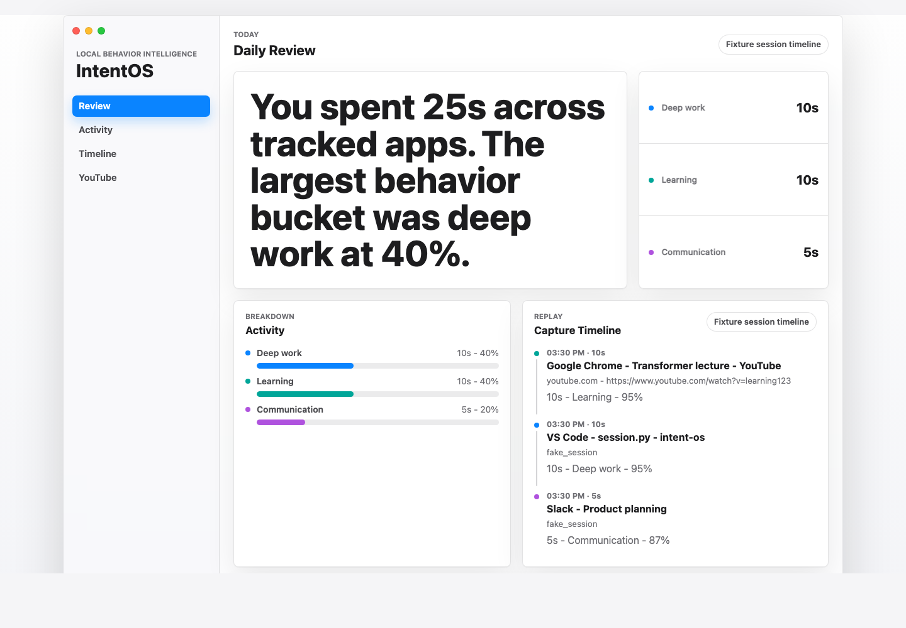
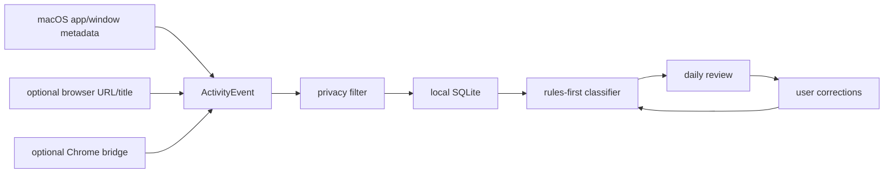

# IntentOS

<p align="center">
  <strong>Your Mac should know whether Chrome time was deep work, learning, admin, or drifting.</strong>
</p>

<p align="center">
  <a href=".github/workflows/verify.yml"></a>
  
  
  
  
</p>

IntentOS is a local-first behavior intelligence layer for digital work.

Screen Time can tell you that you used Chrome for three hours. IntentOS is
being built to tell you what that time meant: deep work, learning, admin,
communication, passive consumption, entertainment, or unknown activity.

It is not another time tracker. It is an on-device system for answering:

> Was my time aligned with what I actually care about?



## Why Developers Care

- It makes productivity data semantic instead of app-level.
- It is local-first: no cloud account, no telemetry pipeline, no remote model
  dependency for the current beta.
- It captures metadata only by default: app name, window title, bounded
  URL/title/domain metadata.
- It treats privacy, testability, and local runtime inspection as product
  requirements.
- It is built so Codex can keep shipping complete, verified product slices.

## What It Does Today

IntentOS currently ships a macOS dogfood beta that can:

- capture frontmost macOS app/window metadata through a native local recorder
- enrich browser title/URL through local browser automation when available
- store events in a local SQLite database with 30-day retention
- classify activity into behavior labels through deterministic local rules
- render a service-backed daily review dashboard
- let users correct labels without mutating raw events
- pause, resume, inspect diagnostics, and delete local data
- package a local macOS menu bar app
- optionally accept richer Chrome tab metadata through a local bridge

The default beta path is live and automated. No manual imports. No CSV exports.
No setup chore before the product can show value.

## Try It In Two Minutes

Requirements:

- macOS for live capture and the menu bar beta
- Python 3 and `make`
- Accessibility permission for real frontmost-window capture

Run the deterministic local product:

```sh
make verify
make dev
```

Run the live dogfood beta on macOS:

```sh
make beta-dev
make beta-status
```

Then open the URL printed as `INTENTOS_BETA_UI_URL`.

Stop the beta runtime:

```sh
make beta-stop
```

Package and install the local menu bar app:

```sh
make package-beta
make install-beta-app
```

Run the real 30-minute dogfood gate:

```sh
make dogfood-smoke
```

`make validate-beta` is the deterministic beta test harness. It uses fake
permission probes and fixture bridge rows against a temporary database. The
normal `make beta-dev` dogfood path does not seed fake activity.

## Privacy Contract

IntentOS is intentionally boring about privacy.

| Rule | Current behavior |
| --- | --- |
| Local first | Service binds to `127.0.0.1`; data stays under `.harness/runtime/`. |
| Metadata only | App name, window title, bounded URL/title/domain metadata. |
| No screenshots | Raw screenshots are not captured or retained. |
| No keylogging | Keyboard input is never captured. |
| No page bodies | Browser page text, cookies, tokens, and bodies are rejected. |
| User control | Pause/resume and delete-local-data are built into the beta. |
| Chrome optional | Native recorder is primary; the Chrome bridge is only enhancement. |

See [docs/SECURITY.md](docs/SECURITY.md) for the full security baseline.

## The Product Loop



Raw events stay raw. Corrections layer on top of classification, so the system
can become more useful without rewriting history.

## Current Status

| Area | Status |
| --- | --- |
| Generic activity classification | Working with fixture evaluation. |
| Manual metadata-only macOS capture | Working locally with Accessibility permission. |
| Background beta recorder | Working in dogfood runtime. |
| Service-backed dashboard | Working. |
| Local corrections | Working. |
| Menu bar app | Local ad-hoc package/install path working. |
| Chrome bridge | Optional; packaged for dogfood bridge smoke. |
| Cloud sync, auth, billing, updater | Out of scope for this dogfood slice. |

Manual metadata-only macOS capture is available through:

```sh
make observe-live
make observe-session
make dev-live
```

These commands are local diagnostics outside CI because they depend on the
current macOS user, current windows, and granted permissions.

## What Makes This Repo Different

This is not just an app prototype. It is an agent-first product harness.

Codex should be able to read the repository, understand the product state,
make a scoped change, run the product, verify behavior, and leave durable
context in docs.

That means the repo treats harness gaps as product bugs:

- UI changes need rendered evidence.
- Capture changes need deterministic fixtures.
- Live macOS features need fake probes for CI.
- Privacy assumptions live in docs and tests.
- Runtime status must be inspectable through commands and artifacts.

## Architecture At A Glance

| Layer | Purpose |
| --- | --- |
| `intentos/activity.py` | Generic `ActivityEvent` boundary. |
| `intentos/classifier.py` | Rules-first behavior classifier. |
| `intentos/reporting.py` | Aggregate behavior summaries. |
| `intentos/capture/` | macOS, browser, privacy, session, and replay adapters. |
| `intentos/beta/` | SQLite store, service APIs, recorder, status, corrections. |
| `web/` | Local daily review dashboard. |
| `macos/IntentOSBeta/` | Native menu bar wrapper. |
| `extension/chrome/` | Optional MV3 Chrome metadata bridge. |
| `scripts/harness/` | Agent-readable runtime and verification harness. |

The canonical architecture doc is
[docs/ARCHITECTURE.md](docs/ARCHITECTURE.md).

## Commands You Will Actually Use

| Goal | Command |
| --- | --- |
| Run all gates | `make verify` |
| Open fixture UI | `make dev` |
| Capture a fresh live UI session | `make dev-live` |
| Observe one live macOS sample | `make observe-live` |
| Observe a bounded live session | `make observe-session` |
| Run real beta | `make beta-dev` |
| Inspect beta health | `make beta-status` |
| Stop beta | `make beta-stop` |
| Validate beta deterministically | `make validate-beta` |
| Package app | `make package-beta` |
| Install app | `make install-beta-app` |
| Package Chrome bridge | `make package-extension` |
| Run real dogfood smoke | `make dogfood-smoke` |
| Refresh screenshot evidence | `make update-ui-screenshot` |
| Diagnose runtime | `make diagnose` |

More commands and artifact contracts live in
[docs/APP_RUNTIME.md](docs/APP_RUNTIME.md).

## Roadmap

The next slices are deliberately practical:

- fresh dogfood install smoke on a clean macOS user
- optional Chrome bridge connected/posting-events smoke
- sharper first-run permission recovery
- richer daily behavior narratives
- local model second-pass classification after rules plateau
- low-confidence visible-text or OCR fallback only if metadata is insufficient

See [docs/NEXT_STEPS.md](docs/NEXT_STEPS.md) for the maintained roadmap.

## Contributing

Read [CONTRIBUTING.md](CONTRIBUTING.md) before opening a pull request. The short
version:

- keep changes scoped to a product slice
- add or update verification when behavior changes
- preserve the local-only privacy contract
- run `make verify` before handoff whenever possible

Issues are welcome for bugs, product ideas, and local dogfood feedback.

## Start Here If You Are Codex

Read these in order:

1. [AGENTS.md](AGENTS.md)
2. [docs/README.md](docs/README.md)
3. [docs/product/BRIEF.md](docs/product/BRIEF.md)
4. [docs/product/TAXONOMY.md](docs/product/TAXONOMY.md)
5. [docs/product/live-capture.md](docs/product/live-capture.md)
6. [docs/ARCHITECTURE.md](docs/ARCHITECTURE.md)
7. [docs/APP_RUNTIME.md](docs/APP_RUNTIME.md)
8. [docs/NEXT_STEPS.md](docs/NEXT_STEPS.md)

Then make the smallest complete product slice and run:

```sh
make verify
```

## License

IntentOS is released under the [MIT License](LICENSE).
