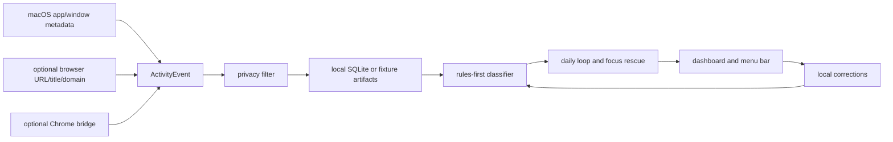

# IntentOS

<p align="center">
  <strong>Private focus rescue for protecting one daily commitment on Mac.</strong>
</p>

<p align="center">
  IntentOS lets you name one focus to protect and one avoid pattern for the day.
  It watches local app, window, and browser metadata, warns when recovery is
  still possible, and gives you an evening receipt of what actually happened.
</p>

<p align="center">
  
  
  
  
  
</p>

<p align="center">
  <a href="#why">Why</a>
  -
  <a href="#what-it-does">What It Does</a>
  -
  <a href="#quick-start">Quick Start</a>
  -
  <a href="#privacy">Privacy</a>
  -
  <a href="#current-status">Status</a>
  -
  <a href="#docs">Docs</a>
</p>


The first product moment: IntentOS compares today's protected focus against the
avoid pattern you named, shows the evidence it found, and gives you a recovery
choice before the day is gone.

## Why

Screen Time can tell you Chrome was open for four hours. It cannot tell whether
that was shipping a feature, reading system design notes, filing taxes,
watching lectures, shopping, or sliding into a feed loop.

IntentOS is for builders who do not need another dashboard after the damage is
done. They need a private system that notices when the important thing is losing
to the avoid pattern they chose that morning, while there is still time to
recover.

## What It Does

IntentOS turns bounded local metadata into a daily intent loop:

1. Set one focus to protect and one thing to avoid.
2. Capture local app, window, title, URL, and domain metadata.
3. Classify that evidence with deterministic, inspectable rules.
4. Show whether focus is protected, avoid is leaking, or evidence needs review.
5. Record the recovery choice and generate an evening plan-vs-actual receipt.

The beta is currently tuned for Mac-based founders, engineers, independent
builders, and knowledge workers with one expensive daily output commitment.

## Quick Start

### 1. See the Product With Fixture Data

This path is the fastest way to understand the product. It uses deterministic
local fixture data and does not require macOS permissions.

```sh
make dev
```

Open the URL printed by the command.

### 2. Run the Real Local Mac Beta

This starts the service-backed beta with local SQLite persistence and native
macOS app/window metadata capture.

```sh
make beta-dev
make beta-status
```

Open the URL printed as `INTENTOS_BETA_UI_URL`. First run walks through
Privacy, App access, Capture check, Daily focus, and First block. Accessibility
is the only required first-value permission; browser detail is optional.

Manual metadata-only macOS diagnostics are available through
`make observe-live`, `make observe-session`, and `make dev-live` when you want
to inspect current local activity outside deterministic CI.

### 3. Prepare a Trusted-Tester App Artifact

Maintainers can package the no-Terminal tester artifact:

```sh
make package-onboarding-beta
```

This writes `.harness/runtime/artifacts/IntentOS-trusted-beta.zip`. The tester
opens `IntentOS.app`; normal onboarding happens inside the app.

Common developer commands:

| Goal | Command |
| --- | --- |
| Run fixture UI | `make dev` |
| Run real local beta | `make beta-dev` |
| Inspect beta health | `make beta-status` |
| Stop beta | `make beta-stop` |
| Package trusted-tester app | `make package-onboarding-beta` |
| Run all checks | `make verify` |

More runtime commands live in [docs/APP_RUNTIME.md](docs/APP_RUNTIME.md).

## What You'll See

- A daily focus/avoid contract that says exactly what IntentOS will protect.
- A capture preview after Accessibility succeeds, limited to current app,
  window, title, and domain evidence.
- A focus-rescue state when the avoid pattern starts beating the protected
  focus.
- One recovery choice: return to focus, continue intentionally, pause capture,
  or correct the evidence.
- An evening receipt comparing the plan with the captured day.

## Privacy

IntentOS treats privacy as product behavior, not a settings footnote.

| Rule | Current behavior |
| --- | --- |
| Local only | Services bind to `127.0.0.1`; runtime data stays on your machine. |
| Metadata first | App name, bundle ID, window title, bounded URL/title/domain metadata. |
| No screenshots | Raw screenshots and screen recordings are not captured or retained. |
| No keylogging | Keyboard input is never captured. |
| No page bodies | Page text, cookies, tokens, and form contents are rejected. |
| User control | Pause/resume, setup restart, setup report, and delete-local-data are built in. |
| Optional browser detail | Native app/window capture is primary; browser detail and Chrome bridge are enrichment only. |

See [docs/SECURITY.md](docs/SECURITY.md) for the full security baseline.

## Current Status

IntentOS is a macOS source beta for trusted testers. It is runnable,
inspectable, fixture-backed, service-backed, and privacy-constrained.

- The fixture UI works without permissions through `make dev`.
- The live beta supports guided first run, stable `IntentOS` permission
  identity, capture preview, local setup report, daily intent, focus rescue,
  correction controls, and evening review.
- The trusted-tester app artifact is available, but this is not a notarized
  public installer, auto-updating app, or broad public beta.
- Verification is deterministic: `make verify` covers harness checks, unit
  tests, beta validation, UI render probes, screenshot freshness, and fixture
  evaluation.
- IntentOS is released under the MIT license.

Manual imports still exist for fixtures and regression tests. They are not the
preferred user path; the beta is designed to show value from live local capture.

## Architecture At A Glance

IntentOS brings review to the data instead of sending the data to a cloud
dashboard.



The classifier is deliberately rules-first today. Local model inference comes
later, only after fixtures show where deterministic rules plateau. See
[docs/ARCHITECTURE.md](docs/ARCHITECTURE.md) for the full system map.

## What It Is Not

- Not a Chrome-only extension.
- Not a keylogger.
- Not a screenshot recorder.
- Not a cloud analytics product.
- Not an employee surveillance tool.
- Not a public installer yet.
- Not an automation agent or blocker in the current beta.

## Docs

| Area | Doc |
| --- | --- |
| Product promise | [docs/product/BRIEF.md](docs/product/BRIEF.md) |
| Behavior taxonomy | [docs/product/TAXONOMY.md](docs/product/TAXONOMY.md) |
| Live capture | [docs/product/live-capture.md](docs/product/live-capture.md) |
| Local inference | [docs/product/on-device-inference.md](docs/product/on-device-inference.md) |
| Architecture | [docs/ARCHITECTURE.md](docs/ARCHITECTURE.md) |
| Runtime | [docs/APP_RUNTIME.md](docs/APP_RUNTIME.md) |
| Trusted beta | [docs/launch/trusted-source-beta.md](docs/launch/trusted-source-beta.md) |
| Quality | [docs/QUALITY.md](docs/QUALITY.md) |
| Roadmap | [docs/NEXT_STEPS.md](docs/NEXT_STEPS.md) |
| Agent workflow | [AGENTS.md](AGENTS.md) |

## Contributing

Read [CONTRIBUTING.md](CONTRIBUTING.md) before opening a pull request. Preserve
the local-only privacy contract, keep changes scoped, add deterministic
verification for behavior changes, and run `make verify` before handoff when
possible.

## License

IntentOS is released under the [MIT License](LICENSE).
