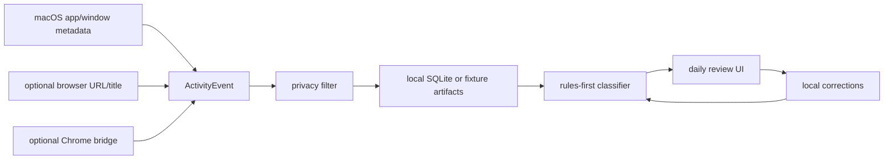

# IntentOS

<p align="center">
  <strong>The private attention audit for your Mac.</strong>
</p>

<p align="center">
  IntentOS turns local app, window, and browser metadata into a daily review of
  what your digital time actually meant: deep work, learning, communication,
  admin, creation, consumption, entertainment, and the unknowns worth fixing.
</p>

<p align="center">
  
  
  
  
  
</p>

<p align="center">
  <a href="#the-manifesto">Manifesto</a>
  ·
  <a href="#try-it">Try it</a>
  ·
  <a href="#privacy-contract">Privacy</a>
  ·
  <a href="#architecture-at-a-glance">Architecture</a>
  ·
  <a href="#documentation-hub">Docs</a>
  ·
  <a href="#start-here-if-you-are-codex">Codex</a>
</p>


## The Manifesto

### The Problem: App Names Lie

Screen Time can tell you Chrome was open for four hours. It cannot tell whether
that was shipping a feature, reading system design notes, filing taxes, watching
lectures, shopping, or sliding into a feed loop.

Most productivity tools stop at the surface:

1. App usage is too blunt. The same app can mean serious work, admin chores,
   intentional rest, or complete drift.
2. Cloud dashboards ask for too much trust. Your digital behavior is personal
   enough that the default place for it is your own machine.
3. Timers create guilt, not insight. The useful question is not "How long was
   this app open?" It is "Was my attention aligned with what I care about?"

### The IntentOS Way: Review Meaning, Not Just Time

IntentOS is a local-first behavior intelligence layer. It captures bounded
metadata, classifies activity through inspectable rules, shows a daily review,
and lets the user correct labels without rewriting raw history.

> The unit of self-awareness is not the app. It is the intent behind the
> session.

## What IntentOS Does

IntentOS answers questions that app timers cannot:

- Was I doing deep work, shallow work, learning, admin, or communication?
- Which surfaces repeatedly pulled me into passive consumption?
- Which sessions were valuable enough to repeat tomorrow?
- Which classifications are low-confidence and need my correction?
- What did I think my day was, and what did the local evidence say it was?

It is being built for engineers, founders, knowledge workers, and high-agency
people who already reflect on their time and want more truthful feedback.

## Why It Should Exist

| Surface | What a normal tracker sees | What IntentOS tries to infer |
| --- | --- | --- |
| Browser | "Chrome: 4h 12m" | Research, docs, taxes, shopping, feeds, lectures, debugging. |
| ChatGPT | "ChatGPT: 1h 08m" | Coding help, learning, admin drafting, planning, casual entertainment. |
| Slack or WhatsApp | "Messages: 52m" | Coordination, relationship maintenance, reactive shallow work. |
| Editor or writing app | "VS Code: 3h 40m" | Deep implementation, review, debugging, stalled switching. |
| YouTube | "YouTube: 47m" | Learning, passive consumption, entertainment, background noise. |

The product keeps raw local events separate from user corrections, so review can
teach the system without destroying the evidence trail.

## Current Status

IntentOS is a trusted macOS source beta. It is runnable, inspectable,
fixture-backed, service-backed, and privacy-constrained. It is not yet a
polished public installer or broad nontechnical beta.

| Capability | Current state |
| --- | --- |
| Native macOS capture | Frontmost app/window metadata through a local recorder. |
| Browser enrichment | Optional title, URL, and domain when local permissions allow it. |
| Chrome bridge | Optional MV3 metadata bridge for dogfood testing. |
| Local persistence | SQLite under `.harness/runtime/beta/` with 30-day retention. |
| Classification | Deterministic, inspectable rules over the product taxonomy. |
| Daily review UI | Service-backed dashboard plus fixture-backed demo mode. |
| Corrections | Local relabel overlays that do not mutate raw events. |
| User controls | Pause, resume, diagnostics, permission guidance, delete local data. |
| Packaging | Local ad-hoc Swift menu bar app build/install path. |
| Verification | `make verify`, UI render checks, beta validation, fixtures. |

Manual imports still exist for fixtures and regression tests. They are not the
preferred user path; the beta is designed to show value from live local capture.
Manual metadata-only macOS diagnostics are available through `make observe-live`,
`make observe-session`, and `make dev-live` when you want to inspect current
local activity outside the deterministic CI path.

## Try It

Requirements:

- Python 3 and `make` for the deterministic demo.
- macOS plus Accessibility permission for live capture and the menu bar beta.

Run the fixture-backed product:

```sh
make dev
```

Open the URL printed as `INTENTOS_APP_URL`.

Run the live local beta:

```sh
make beta-dev
make beta-status
make adapter-fixture-check
make diagnose-json
```

Open the URL printed as `INTENTOS_BETA_UI_URL`.

Stop the beta runtime:

```sh
make beta-stop
```

Build and install the local menu bar app:

```sh
make package-beta
make install-beta-app
```

Run the full local gate:

```sh
make verify
```

For trusted friend testing, start with the menu bar app or `make beta-dev`, use
`Run Permission Check` from the IntentOS menu, and inspect `make beta-status` if
capture looks stuck. The Chrome bridge is optional for the first test pass;
native recorder capture is the primary beta path.

## Privacy Contract

IntentOS treats privacy as product behavior, not a settings footnote.

| Rule | Current behavior |
| --- | --- |
| Local first | Services bind to `127.0.0.1`; runtime data stays under `.harness/runtime/`. |
| Metadata first | App name, bundle ID, window title, bounded URL/title/domain metadata. |
| No screenshots | Raw screenshots are not captured or retained. |
| No keylogging | Keyboard input is never captured. |
| No page bodies | Page text, cookies, tokens, and bodies are rejected. |
| User control | Pause/resume and delete-local-data are built into the beta. |
| Optional Chrome | Native recorder is primary; Chrome bridge is enrichment only. |

See [docs/SECURITY.md](docs/SECURITY.md) for the full security baseline.

## Architecture At A Glance

IntentOS brings review to the data instead of sending the data to a cloud
dashboard.



The classifier is deliberately rules-first today. Local model inference comes
later, only after fixtures show where deterministic rules plateau.

| Layer | Purpose |
| --- | --- |
| `intentos/activity.py` | Generic `ActivityEvent` boundary. |
| `intentos/classifier.py` | Rules-first behavior classifier. |
| `intentos/reporting.py` | Aggregate behavior summaries. |
| `intentos/capture/` | macOS, browser, privacy, session, and replay adapters. |
| `intentos/beta/` | SQLite store, service APIs, recorder, status, corrections. |
| `web/` | Local daily review dashboard. |
| `macos/IntentOSBeta/` | Native menu bar wrapper. |
| `extension/chrome/` | Optional MV3 Chrome metadata bridge. |
| `scripts/harness/` | Runtime, validation, linting, screenshot, and diagnostics. |

The canonical architecture source is
[docs/ARCHITECTURE.md](docs/ARCHITECTURE.md).

## Behavior Taxonomy

IntentOS classifies activity into a small, inspectable set:

| Label | Meaning |
| --- | --- |
| `deep_work` | Focused coding, writing, analysis, or problem solving. |
| `shallow_work` | Low-depth work such as inbox triage or routine tool use. |
| `learning` | Intentional educational or skill-building activity. |
| `communication` | Messages, calls, coordination, relationship maintenance. |
| `admin` | Taxes, billing, banking, forms, travel, account work. |
| `passive_consumption` | Feed loops, low-intent browsing, clips, recommendation drift. |
| `active_creation` | Creating personal or public output outside core work. |
| `entertainment` | Deliberate leisure, games, shows, comedy, sports, music. |
| `unknown` | Sparse or conflicting evidence. |

The source of truth is
[docs/product/TAXONOMY.md](docs/product/TAXONOMY.md).

## Command Reference

| Goal | Command |
| --- | --- |
| Open fixture UI | `make dev` |
| Capture a fresh live UI session | `make dev-live` |
| Run real beta | `make beta-dev` |
| Inspect beta health | `make beta-status` |
| Stop beta | `make beta-stop` |
| Validate beta deterministically | `make validate-beta` |
| Build menu bar beta | `make package-beta` |
| Install menu bar beta | `make install-beta-app` |
| Package Chrome bridge | `make package-extension` |
| Observe one live macOS sample | `make observe-live` |
| Observe a bounded live session | `make observe-session` |
| Run real local capture smoke | `make dogfood-smoke` |
| Refresh screenshot evidence | `make update-ui-screenshot` |
| Diagnose runtime | `make diagnose` |
| Run all gates | `make verify` |

More runtime contracts live in [docs/APP_RUNTIME.md](docs/APP_RUNTIME.md).

## Documentation Hub

| Area | Doc | Use it for |
| --- | --- | --- |
| Product | [docs/product/BRIEF.md](docs/product/BRIEF.md) | Product promise, target user, current state, risks. |
| Taxonomy | [docs/product/TAXONOMY.md](docs/product/TAXONOMY.md) | Behavior labels and classification guidance. |
| Capture | [docs/product/live-capture.md](docs/product/live-capture.md) | macOS metadata capture, permissions, privacy defaults. |
| Local inference | [docs/product/on-device-inference.md](docs/product/on-device-inference.md) | Rules-first and future local model strategy. |
| Architecture | [docs/ARCHITECTURE.md](docs/ARCHITECTURE.md) | System layers, dependency rules, tradeoffs. |
| Runtime | [docs/APP_RUNTIME.md](docs/APP_RUNTIME.md) | Dev, beta, validation, logs, screenshots, artifacts. |
| Design | [docs/DESIGN.md](docs/DESIGN.md) | UX principles and UI quality bar. |
| Quality | [docs/QUALITY.md](docs/QUALITY.md) | Scorecard, verification, known gaps. |
| Roadmap | [docs/NEXT_STEPS.md](docs/NEXT_STEPS.md) | Recommended next product slices. |
| Operations | [docs/OPERATING_MODEL.md](docs/OPERATING_MODEL.md) | Review, CI, PR, and cleanup loops. |

## Roadmap

Current focus: trusted macOS source-beta testing.

- Fresh beta install smoke on a clean macOS user.
- Optional Chrome bridge connected/posting-events smoke.
- Sharper first-run permission recovery.
- Richer daily behavior narratives and next-action review.
- Planned-intent context so the app can compare what happened against what was
  supposed to happen.
- Local model second-pass classification after rules plateau.
- Low-confidence visible-text or OCR fallback only if metadata is insufficient.

See [docs/NEXT_STEPS.md](docs/NEXT_STEPS.md) for the maintained roadmap.

## What It Is Not

- Not a Chrome-only extension.
- Not a keylogger.
- Not a screenshot recorder.
- Not a cloud analytics product.
- Not a public installer yet.
- Not an automation agent or blocker in the current beta.

## Why Star It

Star this repo if you care about:

- a private alternative to app-name productivity tracking
- local semantic classification of real digital behavior
- macOS capture that starts with metadata instead of invasive sensors
- an agent-readable product harness with docs, fixtures, screenshots, and CI
- a practical path from daily review to future local intent intelligence

## Contributing

Read [CONTRIBUTING.md](CONTRIBUTING.md) before opening a pull request. The short
version:

- keep changes scoped to one product or harness improvement
- preserve the local-only privacy contract
- add or update deterministic verification when behavior changes
- update durable docs when product assumptions change
- run `make verify` before handoff whenever possible

Issues are welcome for bugs, product ideas, local beta feedback, and
classification examples that should become fixtures.

## Start Here If You Are Codex

Read these in order:

1. [AGENTS.md](AGENTS.md)
2. [docs/README.md](docs/README.md)
3. [docs/product/BRIEF.md](docs/product/BRIEF.md)
4. [docs/product/TAXONOMY.md](docs/product/TAXONOMY.md)
5. [docs/product/live-capture.md](docs/product/live-capture.md)
6. [docs/product/on-device-inference.md](docs/product/on-device-inference.md)
7. [docs/ARCHITECTURE.md](docs/ARCHITECTURE.md)
8. [docs/APP_RUNTIME.md](docs/APP_RUNTIME.md)
9. [docs/OPERATING_MODEL.md](docs/OPERATING_MODEL.md)
10. the relevant active plan under [docs/plans/active](docs/plans/active)

Then make the smallest complete product slice and run:

```sh
make verify
```

## License

IntentOS is released under the [MIT License](LICENSE).
