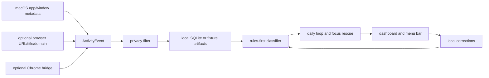

# IntentOS

<p align="center">
  <strong>Local-only Mac focus rescue for protecting today's one commitment.</strong>
</p>

<p align="center">
  Name the work that matters, name the avoid pattern that usually wins, and
  IntentOS turns local app/window evidence into a live protection state plus an
  evening receipt.
</p>

<p align="center">
  
  
  
  
  
</p>

<p align="center">
  <a href="#why">Why</a>
  -
  <a href="#what-it-does">What It Does</a>
  -
  <a href="#quick-start">Quick Start</a>
  -
  <a href="#privacy">Privacy</a>
  -
  <a href="#current-status">Status</a>
  -
  <a href="#docs">Docs</a>
</p>


The first product moment: a trusted Mac tester opens the app, accepts the
local-only promise, grants Accessibility, sets one focus and one avoid target,
sees a live protection state, and gets an evening receipt before the day is
gone.

## Why

Screen Time can tell you Chrome was open for four hours. It cannot tell whether
that was shipping a feature, reading system design notes, filing taxes,
watching lectures, shopping, or sliding into a feed loop.

IntentOS is for builders who do not need another dashboard after the damage is
done. They need a private system that notices when the important thing is losing
to the avoid pattern they chose that morning, while there is still time to
recover and still enough trust to keep using it tomorrow.

## What It Does

IntentOS turns bounded local metadata into a daily intent loop:

1. Set one focus to protect and one thing to avoid.
2. Capture local app, window, title, URL, and domain metadata.
3. Classify that evidence with deterministic, inspectable rules.
4. Show whether focus is protected, avoid is leaking, or evidence needs review.
5. Record the recovery choice and generate an evening plan-vs-actual receipt.

The beta is tuned for Mac-based founders, engineers, independent builders, and
knowledge workers with one expensive daily output commitment.

## Quick Start

### 1. See the Product With Fixture Data

This path is the fastest way to understand the product. It uses deterministic
local fixture data and does not require macOS permissions.

```sh
make dev
```

Open the URL printed by the command.

### 2. Join the Trusted Mac Beta

The normal tester path is the bundled app artifact. Testers should not need to
run `make` or use Terminal unless they are troubleshooting with a maintainer.

Open `IntentOS-trusted-beta.zip`, launch `IntentOS.app`, and follow the in-app
stepper:

1. Privacy
2. App access
3. Capture check
4. Daily focus
5. First block

Accessibility is the only required first-value permission. Browser detail stays
optional and hidden until native app/window capture works.

### 3. Maintainer And Troubleshooting Commands

These commands are for maintainers, local builders, and support sessions. They
run the service-backed beta with local SQLite persistence and native macOS
app/window metadata capture.

```sh
make beta-dev
make beta-status
```

Open the URL printed as `INTENTOS_BETA_UI_URL`.

Manual metadata-only macOS diagnostics are available through
`make observe-live`, `make observe-session`, and `make dev-live` when you want
to inspect current local activity outside deterministic CI.

### 4. Prepare a Trusted-Tester App Artifact

Maintainers can package the no-Terminal tester artifact:

```sh
make package-onboarding-beta
```

This writes `.harness/runtime/artifacts/IntentOS-trusted-beta.zip`. The tester
opens `IntentOS.app`; normal onboarding happens inside the app.

CI also builds and validates this zip on macOS in the `Trusted Beta Artifact`
workflow. Download the latest `IntentOS-trusted-beta-<commit>` workflow artifact
for tester handoff; generated app binaries stay out of git.

Common developer commands:

| Goal | Command |
| --- | --- |
| Run fixture UI | `make dev` |
| Run real local beta | `make beta-dev` |
| Inspect beta health | `make beta-status` |
| Stop beta | `make beta-stop` |
| Package trusted-tester app | `make package-onboarding-beta` |
| Validate package contract | `make package-onboarding-check` |
| Validate cohort evidence template | `make cohort-evidence-check` |
| Run all checks | `make verify` |

More runtime commands live in [docs/APP_RUNTIME.md](docs/APP_RUNTIME.md).

## What You'll See

- A daily focus/avoid contract that says exactly what IntentOS will protect.
- A capture preview after Accessibility succeeds, limited to current app,
  window, title, and domain evidence.
- A first-block state that is hard to miss: Focus protected, Avoid leaking,
  Recovery available, or Needs evidence.
- One recovery choice: return to focus, continue intentionally, pause capture,
  or correct the evidence.
- An evening receipt summarizing protected focus time, avoid leakage, rescue
  choices, corrections, and one next adjustment.

## Privacy

IntentOS treats privacy as product behavior, not a settings footnote.

| Rule | Current behavior |
| --- | --- |
| Local only | Services bind to `127.0.0.1`; runtime data stays on your machine. |
| Metadata first | App name, bundle ID, window title, bounded URL/title/domain metadata. |
| No screenshots | Raw screenshots and screen recordings are not captured or retained. |
| No keylogging | Keyboard input is never captured. |
| No page bodies | Page text, cookies, tokens, and form contents are rejected. |
| User control | Pause/resume, setup restart, setup report, and delete-local-data are built in. |
| Optional browser detail | Native app/window capture is primary; browser detail and Chrome bridge are enrichment only. |

See [docs/SECURITY.md](docs/SECURITY.md) for the full security baseline.

## Current Status

IntentOS is a macOS trusted beta for a small group of technical testers. It is
runnable, inspectable, fixture-backed, service-backed, and privacy-constrained.

- The fixture UI works without permissions through `make dev`.
- The live beta supports a strict first-run stepper, stable `IntentOS`
  permission identity, preflight checks, capture preview, local setup report,
  visible support actions, daily intent, first-block state, focus rescue,
  correction controls, and evening receipt.
- The trusted-tester app artifact is the normal tester path, but this is not a
  notarized public installer, auto-updating app, or broad public beta.
- CI produces the trusted-tester zip as a downloadable workflow artifact on
  macOS; generated binaries are not tracked in the repository.
- Verification is deterministic: `make verify` covers harness checks, unit
  tests, package contract checks, cohort evidence template validation, beta
  validation, UI render probes, screenshot freshness, and fixture evaluation.
- The current success target is a 5-10 person cohort: median setup under 5
  minutes, 5 testers completing 3 days, 3 completing 7 days, and 2 saying they
  would miss IntentOS if it stopped protecting their named focus next week.
- IntentOS is released under the MIT license.

Manual imports still exist for fixtures and regression tests. They are not the
preferred user path; the beta is designed to show value from live local capture.

## Architecture At A Glance

IntentOS brings review to the data instead of sending the data to a cloud
dashboard.



The classifier is deliberately rules-first today. Local model inference comes
later, only after fixtures show where deterministic rules plateau. See
[docs/ARCHITECTURE.md](docs/ARCHITECTURE.md) for the full system map.

## What It Is Not

- Not a Chrome-only extension.
- Not a keylogger.
- Not a screenshot recorder.
- Not a cloud analytics product.
- Not an employee surveillance tool.
- Not a public installer yet.
- Not an automation agent or blocker in the current beta.

## Docs

| Area | Doc |
| --- | --- |
| Product promise | [docs/product/BRIEF.md](docs/product/BRIEF.md) |
| Behavior taxonomy | [docs/product/TAXONOMY.md](docs/product/TAXONOMY.md) |
| Live capture | [docs/product/live-capture.md](docs/product/live-capture.md) |
| Local inference | [docs/product/on-device-inference.md](docs/product/on-device-inference.md) |
| Architecture | [docs/ARCHITECTURE.md](docs/ARCHITECTURE.md) |
| Runtime | [docs/APP_RUNTIME.md](docs/APP_RUNTIME.md) |
| Trusted beta | [docs/launch/trusted-source-beta.md](docs/launch/trusted-source-beta.md) |
| Quality | [docs/QUALITY.md](docs/QUALITY.md) |
| Roadmap | [docs/NEXT_STEPS.md](docs/NEXT_STEPS.md) |
| Agent workflow | [AGENTS.md](AGENTS.md) |

## Contributing

Read [CONTRIBUTING.md](CONTRIBUTING.md) before opening a pull request. Preserve
the local-only privacy contract, keep changes scoped, add deterministic
verification for behavior changes, and run `make verify` before handoff when
possible.

## License

IntentOS is released under the [MIT License](LICENSE).
