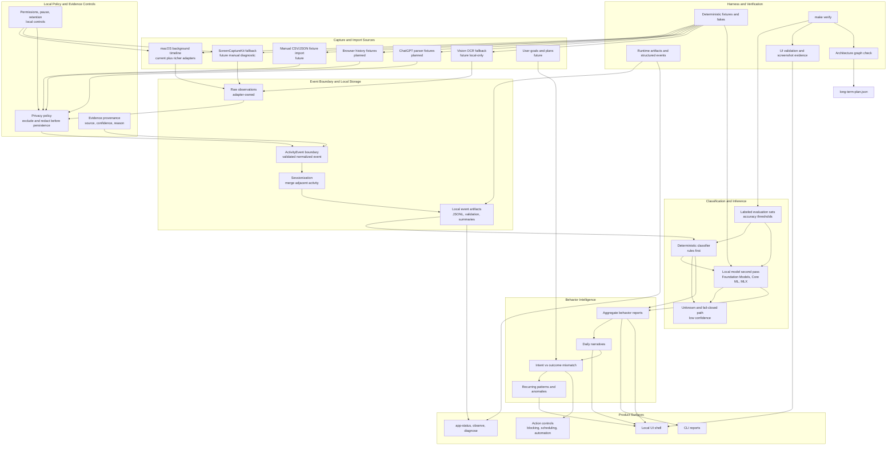

# Long-Term Architecture Plan

This document is the long-term architecture map for IntentOS. It complements
[../ARCHITECTURE.md](../ARCHITECTURE.md), which describes the current shipped
layers. The harness-readable source for this plan is
[long-term-plan.json](long-term-plan.json); this Markdown file is the human
projection of that graph.

Status terms:

- `current`: implemented and covered by `make verify`.
- `next`: the active or recommended next slice.
- `planned`: specified with harness contracts, not yet implemented.
- `future`: product vision that still needs a scoped plan before code.

## End-State Diagram

## Layer Contracts

| Layer | Owner | Long-term contract | Harness hook |
| --- | --- | --- | --- |
| Capture and import sources | Source adapters and import parsers | Read local user data through the narrowest available surface and emit bounded observations or records. | Every source needs deterministic fixtures or fakes before it can be part of `make verify`. |
| Local policy and evidence controls | Privacy, permissions, and provenance helpers | Apply exclusions, redaction, pause state, retention, and evidence provenance before persisted artifacts exist. | Runtime events must report mode, permission status, excluded counts, redaction counts, artifact paths, and status. |
| Event boundary and local storage | `ActivityEvent`, sessionization, JSONL, validation summaries | Normalize every source into the same event model; merge adjacent equivalent activity above adapters. | Stable artifacts live under `.harness/runtime/artifacts/` and must be replayable. |
| Classification and inference | Deterministic classifier plus optional local model boundary | Rules remain the inspectable baseline; local models are second pass only and must fail closed to `unknown`. | Labeled fixtures, accuracy thresholds, fake or tiny model paths, fallback reasons, and no network dependency in CI. |
| Behavior intelligence | Reporting, narratives, mismatch, and anomaly logic | Build insights from classified report artifacts, not raw sensitive source data. | Narrative and insight outputs need deterministic summaries and UI evidence when visible. |
| Product surfaces | CLI, local UI, diagnostics, future action controls | Surface current behavior, evidence, confidence, and operational state without hiding local processing. | `make validate-ui`, screenshot evidence, `make observe`, and `make diagnose` must cover user-visible workflows. |
| Harness and verification | Harness scripts and docs | Keep the roadmap runnable, inspectable, and drift-resistant. | `make harness-check` validates this graph; `make verify` runs harness checks before product checks. |

## Phase Plan

| Phase | Capability | Architecture change | Harness requirement |
| --- | --- | --- | --- |
| 0. Current foundation | Fixture-backed classification, metadata capture, automated background timeline, session timeline, local UI | Existing sources normalize into `ActivityEvent`, replay through deterministic rules, merge live samples into a user-facing timeline, and render local reports. | Keep `make verify`, UI validation, screenshot evidence, capture fixtures, and live diagnostics passing. |
| 1. Automated context | Browser extension, calendar/planned intent, Accessibility excerpts, IDE/Git/terminal context | Add automated source adapters that deepen the current timeline without manual export/import friction. | Add fake adapters or fixtures, privacy exclusions, permission diagnostics, replay artifacts, and UI evidence when visible. |
| 2. Parser fixtures | Browser history and ChatGPT parser fixtures | Add source-specific fixtures that bound evidence and expand evaluation without making manual import the user path. | Use copied/exported fixtures, privacy exclusions, parser validation, replay artifacts, and UI evidence when visible. |
| 3. Behavior intelligence | Daily narratives, mismatch, recurring patterns | Add insight modules above report artifacts; avoid re-reading raw sensitive source payloads. | Add deterministic narrative fixtures, JSON summaries, UI validation, and quality notes. |
| 4. Harder live gaps | ScreenCaptureKit, Vision OCR, local model second pass | Add fallback adapters and a local inference boundary only for low-confidence or sparse metadata cases. | Keep screenshots disabled by default, add fixture frames/OCR/model fakes, permission diagnostics, and model fallback reasons. |
| 5. Control plane | Blocking, scheduling, automation, and agentic actions | Add explicit user-approved action adapters fed by insights and goals, not raw capture streams. | Require scoped plans, dry-run fixtures, audit logs, rollback behavior, and UI workflow validation before real actions. |

## Harness Usage

The JSON graph is intended for scripts and future agents. Harness checks use it
to confirm that the long-term architecture still includes the required roadmap
nodes, that edges reference valid node IDs, and that linked docs exist.

When a future slice changes architecture direction:

1. Update [long-term-plan.json](long-term-plan.json) first with the relevant
   node, phase, docs, artifacts, and harness contracts.
2. Update this Markdown diagram if the human view changes.
3. Update the active plan and feature contract before implementation.
4. Extend harness checks when a repeated architectural rule should become
   mechanical policy.

## Design Constraints

- New source adapters must not own behavior classification.
- Privacy filtering must happen before user-derived runtime artifacts are
  persisted.
- The classifier must preserve `unknown` for sparse, ambiguous, or unavailable
  evidence.
- Models, screenshots, OCR, and action execution remain optional second-pass
  capabilities, not prerequisites for the core local product loop.
- `make verify` must stay deterministic, permission-free, and network-free.
